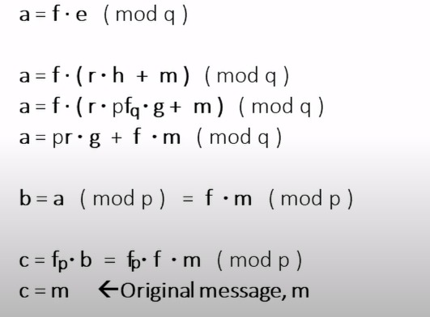

> [!Important]
> **Prerequisites:**
> - [Required Mathematics for NTRU](./Required%20Mathematics%20for%20NTRU.md)

We are going to implement [NTRU](https://en.wikipedia.org/wiki/NTRU) as our Minor 1 project.

| Sender                               | Reciever                                |
| ---------------------------------- | -------------------------------------- |
| Request for an HTTP Handshake Sent | Request for an HTTP Handshake Recieved |
|                                    | Generate Parameters                                       |
|                                    | Generating Keys                        |
| Public Key and Parameters Recieved                | Public Key and Parameters Sent                        |
| Encryption done                    |                                        |
| Encrypted Cipher Text Sent         | Cipher Text Recieved                   |
|                                    | Decryption done                        |
# Definition

We operate on Polynomial Ring with Coefficient over (**Z mod p**) where p is prime. 
```txt
Z[x] // notation to write a Polynomial Ring over Z (Integer Ring)
```

Euclidean algorithm allows us to find inverses of any element in a Quotient Ring. Hence the Polynomial Quotient Ring we will use is:

$$Z[x] / ( x^N - 1 ) | N is prime$$

we have:
> [!Note]
> This is what a polynomial would look like in Z[ x ]
> 
> $f[x] = a_0.x + a_1.x + ... + a_n.x : a_i ∈ Zmodp$
# Generating Parameters
## Generate N, p and q
We need to generate:
1. `N` - large prime number which will be the highest degree for our Polynomials. 
> [!Note]
>   We operate on a Quotient polynomial Ring defined as Polynomial ring over the ideal of $x^N-1$

2. `p & q` - co-prime Numbers where $q>>p$.
> [!Note]
> Generation of polynomial inverses of f with Integer coefficients modulo p and q  
## Generate 2 Random Polynomials
We need to generate 2 Polynomials $f$ and $g$ with degree of at most $N-1$.

## Generate Inverses of $f$ over coefficient ring modulo $p$ and $q$
Use Bézout's Identity to generate the inverse:
if in the Bézout's identity: 

$$
(a.x) + (b.y) = gcd(a, b)
$$

we place 

$$
a.x = f(x).f'(x) \\
$$

$$
b.y = a(x).(x^N -1)
$$

such that the GCD is 1:
hence we get,

$$
f(x).f'(x) + a(x).(x^N -1) = 1 
$$

here we have 

$$
a(x).(x^N -1) = I
$$

where $I$ is the ideal of the Quotient Ring that we are working with.
As Ideal are congruent to 0 in a quotient Ring we may simply write:

$$
f(x).f'(x) = 1
$$

thus meaning $f'(x)$ is the inverse of $f(x)$.
> [!Note]
> To find inverse of the polynomial we have to use the Bézout's identity.
> Where the Euclidean algorithm will be used on $f(x)$ and $x^N - 1$ with $GCD = 1$ thus giving us the values for $f'(x)$ and $a(x)$
# Process
## Key-Generation
We have 
- 2 polynomials( f(x) and g(x) ) with degree < N-1
- p, q are 2 public prime numbers.

we find inverse if $f(x)$ using Bézout identity in the rings $Zmodp$ and $Zmodq$ and end up with $f_p$ and $f_q$.

$$
f.f_p=1
$$

$$
f.f_q=1
$$

The private keys => $f$, $f_q$ and $g$.

The public keys => $h=p . f_q . g (mod q)$

Go to [NTRU's Wikipedia Page](https://en.wikipedia.org/wiki/NTRU#:~:text=NTRU%20is%20an%20open%2Dsource,to%20encrypt%20and%20decrypt%20data.) for more Note.
## Encryption
TBC
## Decryption
